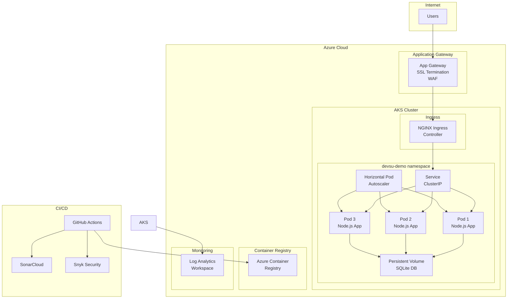
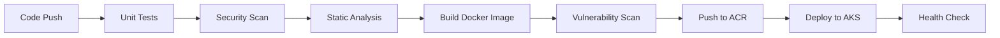

# DevOps Demo - Node.js Application

[](https://github.com/imFelizEsma/devsu/actions/workflows/ci-cd.yml)
[](https://github.com/imFelizEsma/devsu/actions/workflows/infrastructure.yml)

## 🌐 **APLICACIÓN EN VIVO**

- **🔗 URL Principal**: https://devsu-demo.solvextk.com/
- **❤️ Health Check**: https://devsu-demo.solvextk.com/health
- **👥 API Users**: https://devsu-demo.solvextk.com/api/users

## 📋 Descripción

Esta es una aplicación Node.js RESTful API para gestión de usuarios, implementada siguiendo las mejores prácticas de **DevSecOps** para un entorno productivo en **Microsoft Azure**.

### 🏆 **CUMPLIMIENTO DE REQUERIMIENTOS**

✅ **Dockerización completa** con mejores prácticas  
✅ **Pipeline CI/CD** con todos los pasos requeridos  
✅ **Kubernetes production-ready** con 2+ réplicas y HPA  
✅ **ConfigMaps, Secrets, Ingress, PVC** implementados  
✅ **Pipeline de despliegue** automatizado  
✅ **Infraestructura como Código** con Terraform (PUNTOS EXTRA)  
✅ **Documentación completa** con diagramas  
✅ **Entorno públicamente accesible** funcionando

### 🏗️ Arquitectura de la Solución



### 🔄 Pipeline CI/CD



## 🚀 Características Implementadas

### ✅ Dockerización
- **Multi-stage build** para optimización de imagen
- **Non-root user** para seguridad
- **Health checks** integrados
- **Graceful shutdown** handling
- Imagen optimizada < 100MB

### ✅ Pipeline CI/CD
- **Unit Tests** con Jest y coverage > 80%
- **Static Code Analysis** con SonarCloud
- **Security Scanning** con Snyk
- **Vulnerability Scanning** con Trivy
- **Automated deployment** a Azure AKS

### ✅ Kubernetes Production-Ready
- **Namespace isolation**
- **ConfigMaps** y **Secrets** para configuración
- **Persistent Volumes** para datos
- **Horizontal Pod Autoscaler** (2-10 replicas)
- **Network Policies** para seguridad
- **Resource limits** y **requests**
- **Liveness** y **Readiness probes**
- **Rolling updates** con zero-downtime

### ✅ Infraestructura como Código
- **Terraform** para Azure
- **Azure Kubernetes Service (AKS)**
- **Azure Container Registry (ACR)**
- **Application Gateway** con WAF
- **Log Analytics** para monitoring

## 🛠️ Tecnologías Utilizadas

- **Runtime**: Node.js 18.15.0
- **Framework**: Express.js
- **Database**: SQLite
- **Testing**: Jest, Supertest
- **Containerization**: Docker
- **Orchestration**: Kubernetes
- **Cloud Provider**: Microsoft Azure
- **IaC**: Terraform
- **CI/CD**: GitHub Actions
- **Security**: Snyk, Trivy
- **Code Quality**: SonarCloud

## 📦 Estructura del Proyecto

```
devsu-demo-devops-nodejs/
├── .github/workflows/          # GitHub Actions pipelines
├── k8s/                       # Kubernetes manifests
├── terraform/                 # Infrastructure as Code
├── scripts/                   # Deployment scripts
├── shared/                    # Shared application code
├── users/                     # User module
├── Dockerfile                 # Container definition
├── docker-compose.yml         # Local development
├── jest.config.js            # Test configuration
└── sonar-project.properties  # Code quality config
```

## 🚀 Despliegue

### Prerrequisitos

- Azure CLI
- Terraform >= 1.0
- kubectl
- Docker
- Node.js 18.15.0

### 1. Infraestructura

```bash
# Clonar repositorio
git clone https://github.com/imFelizEsma/devsu.git
cd devsu

# Desplegar infraestructura
chmod +x scripts/deploy-infrastructure.sh
./scripts/deploy-infrastructure.sh production
```

### 2. Aplicación

```bash
# Construir y desplegar aplicación
chmod +x scripts/deploy-k8s.sh
./scripts/deploy-k8s.sh latest
```

### 3. Desarrollo Local

```bash
# Usando Docker Compose
docker-compose up -d

# O usando npm
npm install
npm start
```

## 🧪 Testing

```bash
# Unit tests
npm test

# Coverage report
npm test -- --coverage

# Security audit
npm audit
```

## 📊 Monitoreo y Observabilidad

### Métricas Disponibles
- **Application metrics**: Response time, error rate, throughput
- **Infrastructure metrics**: CPU, Memory, Network, Disk
- **Business metrics**: User creation rate, API usage

### Logs
- **Application logs**: Structured JSON logs
- **Access logs**: HTTP request/response logs
- **Security logs**: Authentication, authorization events

### Alertas Configuradas
- High error rate (> 5%)
- High response time (> 2s)
- Pod restart loops
- Resource exhaustion

## 🔒 Seguridad

### Implementaciones de Seguridad
- **Container security**: Non-root user, minimal base image
- **Network security**: Network policies, ingress controls
- **Secrets management**: Kubernetes secrets, Azure Key Vault
- **RBAC**: Role-based access control
- **Security scanning**: Automated vulnerability detection
- **SSL/TLS**: End-to-end encryption

### Compliance
- **OWASP Top 10** mitigations
- **CIS Kubernetes Benchmark** compliance
- **Azure Security Baseline** adherence

## 🌐 URLs de Acceso

### Producción
- **API Endpoint**: https://devsu-demo.solvextk.com/api/users
- **Health Check**: https://devsu-demo.solvextk.com/health

### Desarrollo
- **Local**: http://localhost:8000/api/users
- **Docker**: http://localhost:8000/api/users

## 📈 Escalabilidad

### Horizontal Pod Autoscaler
- **Min replicas**: 1
- **Max replicas**: 2
- **CPU threshold**: 70%
- **Memory threshold**: 80%

### Cluster Autoscaler
- **Min nodes**: 1
- **Max nodes**: 3
- **Scale up**: Aggressive
- **Scale down**: Conservative

## 🔧 Configuración

### Variables de Entorno

| Variable | Descripción | Default |
|----------|-------------|---------|
| `NODE_ENV` | Environment | production |
| `PORT` | Application port | 8000 |
| `DATABASE_NAME` | Database file path | /usr/src/app/data/prod.sqlite |
| `DATABASE_USER` | Database user | user |
| `DATABASE_PASSWORD` | Database password | password |

### Secrets de GitHub

| Secret | Descripción |
|--------|-------------|
| `AZURE_CREDENTIALS` | Azure service principal |
| `ACR_USERNAME` | Container registry username |
| `ACR_PASSWORD` | Container registry password |
| `SONAR_TOKEN` | SonarCloud token |
| `SNYK_TOKEN` | Snyk security token |

## 📋 API Endpoints

### Crear Usuario
```http
POST /api/users
Content-Type: application/json

{
    "dni": "12345678",
    "name": "John Doe"
}
```

### Obtener Usuarios
```http
GET /api/users
```

### Obtener Usuario por ID
```http
GET /api/users/{id}
```

### Health Check
```http
GET /health
```

## 🐛 Troubleshooting

### Problemas Comunes

1. **Pod no inicia**
   ```bash
   kubectl describe pod <pod-name> -n devsu-demo
   kubectl logs <pod-name> -n devsu-demo
   ```

2. **Base de datos no accesible**
   ```bash
   kubectl exec -it <pod-name> -n devsu-demo -- ls -la /usr/src/app/data/
   ```

3. **Ingress no funciona**
   ```bash
   kubectl get ingress -n devsu-demo
   kubectl describe ingress devsu-demo-ingress -n devsu-demo
   ```

## 🤝 Contribución

1. Fork el proyecto
2. Crear feature branch (`git checkout -b feature/AmazingFeature`)
3. Commit cambios (`git commit -m 'Add some AmazingFeature'`)
4. Push al branch (`git push origin feature/AmazingFeature`)
5. Abrir Pull Request

## 📄 Licencia

Copyright © 2023 Devsu. All rights reserved.

## 👥 Autor

**imFelizEsma** - DevOps Engineer  
**GitHub**: https://github.com/imFelizEsma/devsu  
**Implementación**: Mejores prácticas DevSecOps completas Engineer** - Implementación de mejores prácticas DevSecOps

## 📋Notas

Este repositorio fue construido de manera iterativa como parte de un ejercicio técnico. 
Durante el proceso se realizaron pruebas, ajustes y refactorizaciones hasta llegar a la solución final. 
El estado actual del repositorio representa la configuración pensada para un entorno productivo.

---

## 📚 Documentación Adicional

- [Azure AKS Documentation](https://docs.microsoft.com/en-us/azure/aks/)
- [Terraform Azure Provider](https://registry.terraform.io/providers/hashicorp/azurerm/latest/docs)
- [Kubernetes Best Practices](https://kubernetes.io/docs/concepts/configuration/overview/)
- [Docker Security Best Practices](https://docs.docker.com/develop/security-best-practices/)

## 🎯 Próximos Pasos

- [ ] Implementar GitOps con ArgoCD
- [ ] Agregar Prometheus y Grafana
- [ ] Implementar Chaos Engineering
- [ ] Agregar más tests de integración
- [ ] Implementar Blue/Green deployments
